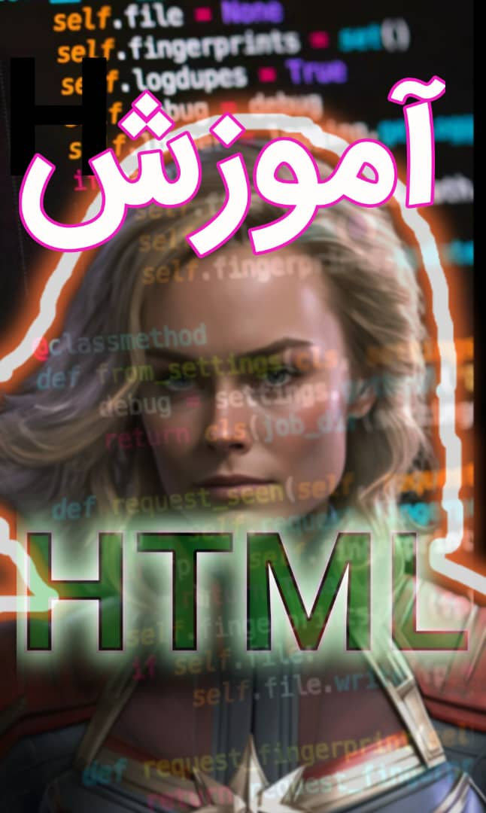

<html lang="fa" dir="rtl">
<head>
<meta charset="utf-8">
<meta name="viewport" content="width=device-width,initial-scale=1">
<title>برنامه نویسی مهراد</title>

</head>
<body data-theme="light">

<header>
  
برنامه نویسی مهراد 

  <nav>
    <a href="#hero">خانه</a><a href="#works">آموزش ها </a><a href="#login">تماس</a>
  </nav>
  <button id="themeBtn">حالت شب</button>
  

  

    <a href="#hero">خانه</a><a href="#works">آموذش ها </a><a href="#login">تماس</a>
  

</header>

<main style="padding-top:64px">

  <!-- HERO -->
  <section id="hero" class="hero">
    
    

      
      <h1>برنامه نویسی مهراد</h1>
      
طراحی، توسعه برنامه نویسی برای رشد کسب‌وکار شما

      <button onclick="document.getElementById('login').scrollIntoView({behavior:'smooth'})">تماس با ما</button>
    

    

      <b></b><b></b><b></b><b></b>
      
    

    
  </section>

  
  <!-- نمونه کارها -->
  <section id="works">
    
    <h2 class="section-title">آموزش ها</h2>
    <table>
      <tr>
        <td></td>
        <td><h1>با سلام برنامه نویسی مهراد قصت دارد درزمینه طراحی سایت برای تبلیغات ومعروفیت شما در هر زمینه کاری انجام دهد . مابعلاوه اینکه پروزه شمارا دریاف میکنیم آموزش هم میدهیم</h1></td>

      </tr>
    </table>
    <a href="https://t.me/programmingmehrad" style="text-decoration: none;">
    

<h3 style="color: #04ff00;">  برای رزرو پروژه هاوآموزش ها با ما در ارتباط باشید</h3>

   </a>
  
    

      

          
        

            

            

            

            

            

            

            

            

            

      

      

          <h1 data-content="">
              
          </h1>
          

              <h2></h2>
              
<b></b>

              

                  
              

          

          

      

  

  

    

      
      

        <a href="https://t.me/programmingmehrad" style="color: red;text-decoration: none;">
        قیمت دوره  4000000تومان</a>
      

      

        <a href="https://t.me/programmingmehrad" style="color: red;text-decoration: none;">
        قیمت دوره  800تومان</a>
      

      

        <a href="https://t.me/programmingmehrad" style="color: red;text-decoration: none;">
       قیمت دوره  400تومان</a>
      

      

        <a href="https://t.me/programmingmehrad" style="color: red;text-decoration: none;">
        قیمت آموزش نصب 150تومان</a>
      

      

        <a href="https://t.me/programmingmehrad" style="color: red;text-decoration: none;">
        قیمت دوره 950تومان</a>
      

      

        <a href="https://t.me/programmingmehrad" style="color: red;text-decoration: none;">
        قیمت آموزش نصب 200تومان</a>
      

      

        <a href="https://t.me/programmingmehrad" style="color: red;text-decoration: none;">
        قیمت دوره 500تومان</a>
      

      

        <a href="https://t.me/programmingmehrad" style="color: red;text-decoration: none;">
        قیمت دوره 500تومان</a>
      

      

        <a href="https://t.me/programmingmehrad" style="color: red;text-decoration: none;">
        قیمت دوره 650تومان</a>
      

      

        <a href="https://t.me/programmingmehrad" style="color: red;text-decoration: none;">
        قیمت دوره650تومان</a>
      

    

  </section>

  <!-- فرم ورود -->
  <section id="login">
    <h2 class="section-title">فرم تماس </h2>
    

      <h2>حساب کاربری</h2>
      <input type="email" placeholder="ایمیل">
      <input type="password" placeholder="رمز عبور">
      
      <a href="tel:9809054062592"><button>تماس با ما</button></a>
    

  </section>
</main>

<footer>&copy; ۲۰۲۵ برنامه نویسی مهراد. تمامی حقوق محفوظ است.</footer>

</body>
</html>
